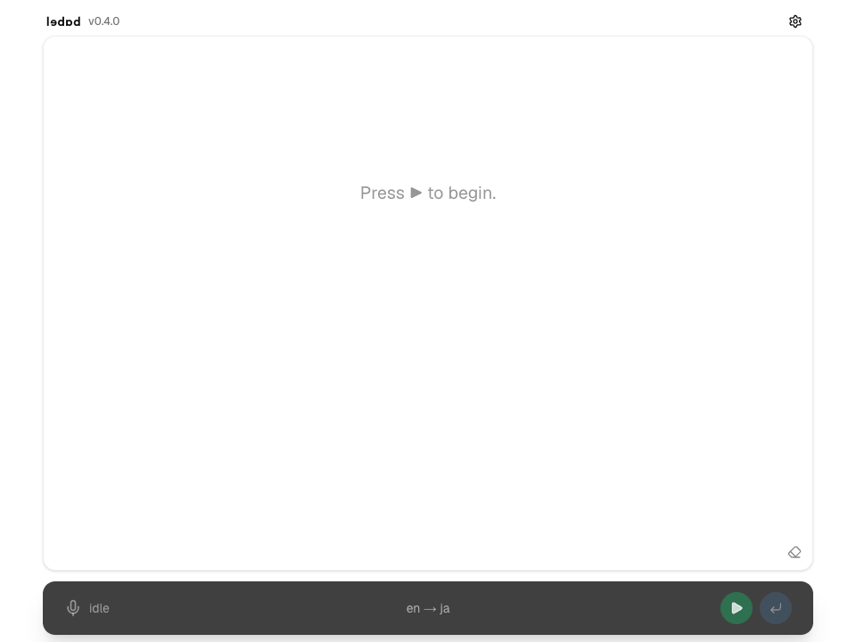

# ledad

[日本語](README.ja.md) | [English](README.md) | [Français](README.fr.md) | [中文](README.zh.md)



Browser-based web app for real-time speech transcription and translation using microphone input.

## How it works

The browser streams microphone audio to the OpenAI Realtime API over WebRTC. Next.js Route Handlers negotiate the Realtime connection and send transcript text to the Responses API for translation, keeping the OpenAI API key on the server. The audio buffer is committed automatically every 15 seconds so longer speech is finalized and translated without manual input.

Built with Next.js 16, React 19, TypeScript, and the OpenAI Realtime and Responses APIs.

## Features

- Browser microphone input
- Real-time speech transcription
- Translation of transcribed text
- Source and target language switching
- Start, stop, commit, and clear session controls

## Usage

Choose the source and target languages in the control panel at the bottom of the screen.

Press `Start` to request microphone permission and start transcription. When speech is recognized, transcription and translation appear in the main panel.

Press `Stop` to stop microphone input and the Realtime connection.

Press `Commit` to commit the current audio buffer and finalize the current transcript for translation. During a session, the audio buffer is also committed automatically every 15 seconds.

Press `Clear` to clear the displayed history.

## Requirements

- Node.js
- OpenAI API key

## Setup

Create `.env.local` and set your OpenAI API key.

```bash
OPENAI_API_KEY=your_api_key
```

Install dependencies.

```bash
npm install
```

Start the development server.

```bash
npm run dev
```

Open this URL in your browser.

```txt
http://localhost:3000
```

## Notes

- You need to allow microphone access in the browser.
- OpenAI API usage may incur costs.
